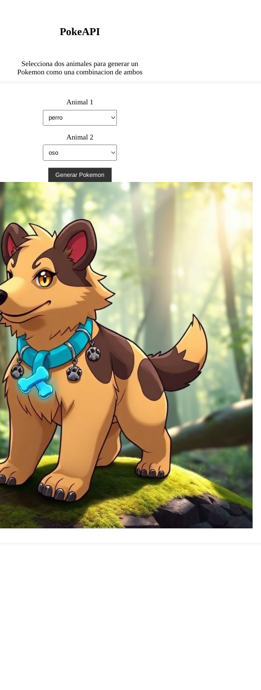

# Run project

## 🧞 Commands

All commands are run from the root of the project, from a terminal:

| Command                   | Action                                           |
| :------------------------ | :----------------------------------------------- |
| `npm run dev`             | Starts local dev server at `localhost:4321`      |

Then go to localhost:4321 in browser

# Example
